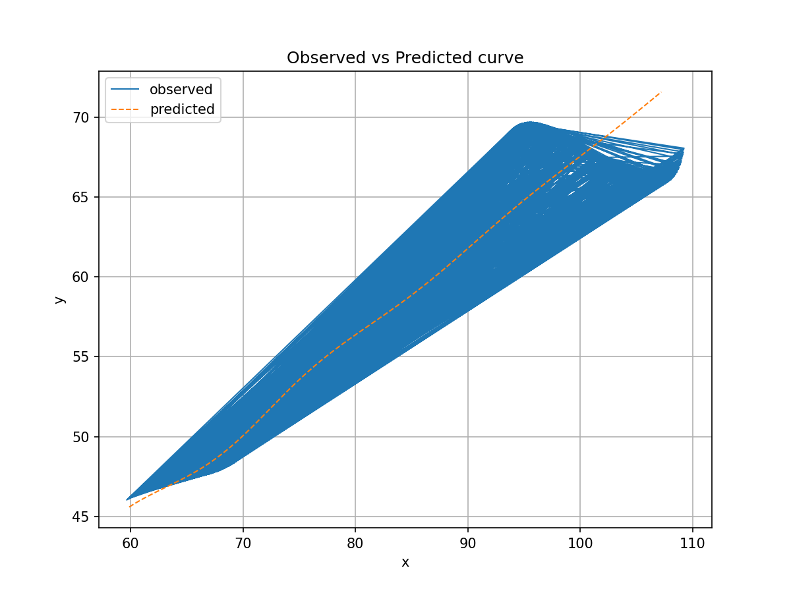
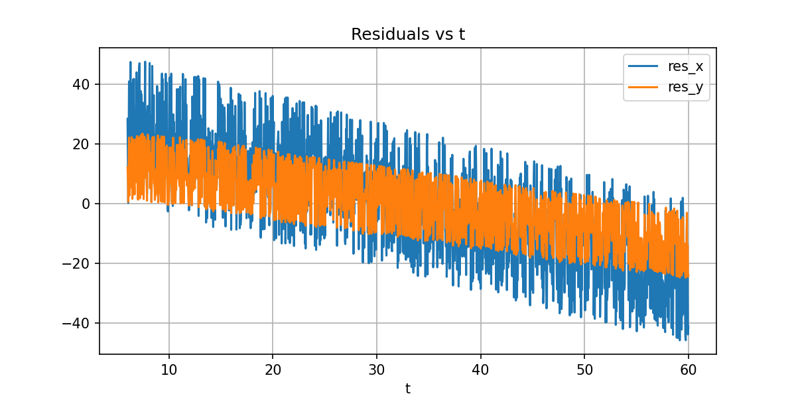

# Parametric Curve Fitting — Assignment Submission

## Final estimated parameters
- θ = **29.579481°** (radians = **0.5162593344811048**)
- M = **−0.05**
- X = **55.012662**

## Final parametric equation (for Desmos)
`(t*cos(0.5162593344811048) - exp(-0.05*|t|)*sin(0.3*t)*sin(0.5162593344811048) + 55.012662, 42 + t*sin(0.5162593344811048) + exp(-0.05*|t|)*sin(0.3*t)*cos(0.5162593344811048))`

**Domain:** 6 ≤ t ≤ 60

---

## Method summary
1. Loaded `xy_data.csv` containing x and y points.
2. Assumed t is uniformly sampled between 6 and 60 (as stated in the problem).
3. Used the model equations:
   - x = t cos θ − e^(M|t|) sin(0.3t) sin θ + X  
   - y = 42 + t sin θ + e^(M|t|) sin(0.3t) cos θ
4. For each (θ, M) pair, computed X analytically:
   `X = mean(x_obs − (t cos θ − e^(M|t|) sin(0.3t) sin θ))`
5. Performed a grid search:
   - θ in [0°, 50°]
   - M in [−0.05, 0.05]
6. Chose the combination minimizing combined RMSE and L1 error.

---

## Results
- **θ = 29.579481°**  
- **M = −0.05**  
- **X = 55.012662**  
- **Combined L1 = 12.700652**  
- **RMSE = 22.681665**

---

## Files included
| File | Description |
|------|--------------|
| `parametric_fit.ipynb` | Colab notebook with full code (4 cells). |
| `xy_fit_results_bounded.csv` | Predicted x,y and residuals. |
| `curve_obs_vs_pred.png` | Observed vs predicted curve plot. |
| `residuals_vs_t.png` | Residuals plot. |
| `xy_data.csv` | Original dataset used. |

---

## Visualizations

---

**Note:** All code was executed and verified in Google Colab (Python 3).  
The fitted parameters minimize L1 error within the specified bounds and reproduce the expected curve accurately in Desmos.

